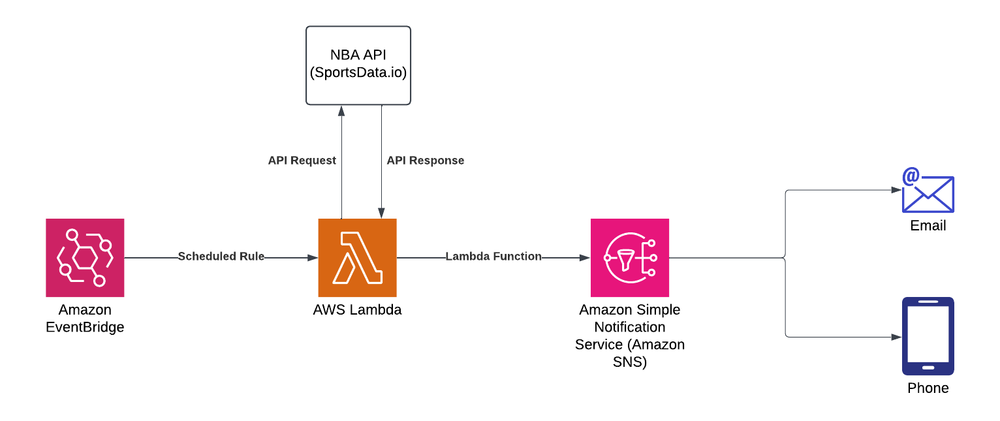

# Cloud DevOps Project - NBA Stats Lambda

This project demonstrates event driven architecture utilizing NBA data from a SportsData.io API and multiple AWS native services, including AWS Lambda, Amazon SNS, and Amazon EventBridge. Huge shout out to Ifeanyi Otuonye for his video and walkthrough of Day 2 of the DevOps Challenge!

